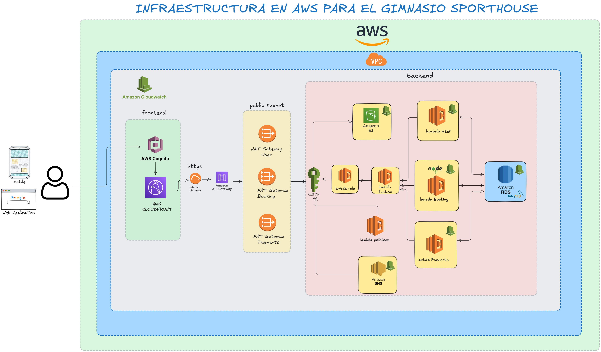

# 🏋️ Sistema de Gestión de Gimnasio - AWS Infrastructure

[](https://aws.amazon.com/)
[](https://www.terraform.io/)
[](LICENSE)

## 📋 Descripción del Proyecto

Sistema completo de gestión de gimnasio desplegado en AWS usando infraestructura como código (Terraform). Incluye arquitectura serverless, base de datos, almacenamiento, API Gateway y monitoreo completo.

## 🏗️ Arquitectura



*Diagrama completo de la infraestructura serverless en AWS - Frontend (CloudFront, Cognito, API Gateway) conectado con Backend (Lambda, RDS, S3) en arquitectura Multi-AZ con monitoreo CloudWatch*

> 💡 **Tip**: Haz clic en la imagen para verla en tamaño completo y explorar todos los componentes y conexiones.

### 🎯 Componentes Frontend:
- **CloudFront**: Distribución global de contenido con cache y compresión
- **Cognito**: Autenticación de usuarios con User Pool e Identity Pool
- **API Gateway**: Endpoints REST para comunicación con backend
- **Internet Gateway**: Conectividad pública

### ⚙️ Componentes Backend:
- **VPC y Networking**: Subredes públicas y privadas en múltiples AZs
- **Lambda**: 3 funciones serverless (usuarios, reservas, pagos)
- **RDS MySQL**: Base de datos Multi-AZ con clase db.t3.micro
- **S3**: Almacenamiento de archivos con acceso público bloqueado  
- **IAM**: Roles y políticas de seguridad + SNS para notificaciones
- **CloudWatch**: Dashboard de monitoreo y 9 alarmas configuradas

### 🔐 Grupos de Usuarios Cognito:
- **gym-admins**: Administradores con acceso completo
- **gym-trainers**: Entrenadores con acceso limitado  
- **gym-members**: Miembros con acceso básico

### 📊 Flujo de Datos (según diagrama):
1. **Usuario** → **CloudFront** (CDN global)
2. **CloudFront** → **Cognito** (autenticación)
3. **Frontend** → **API Gateway** (endpoints REST)
4. **API Gateway** → **Lambda Functions** (lógica de negocio)
5. **Lambda** → **RDS MySQL** (persistencia de datos)
6. **Lambda** → **S3** (almacenamiento de archivos)
7. **CloudWatch** monitorea todos los componentes
8. **SNS** envía notificaciones y alertas

### 🌐 Arquitectura de Red:
- **Public Subnets**: Internet Gateway, NAT Gateways, Load Balancers
- **Private Subnets**: Lambda Functions, RDS, aplicaciones backend
- **Multi-AZ**: Alta disponibilidad en múltiples zonas de disponibilidad

## 🚀 Descripción
Infraestructura como código para sistema de gestión de gimnasio usando AWS con arquitectura completa que incluye frontend, backend, autenticación, monitoreo y seguridad.

### ✨ Nuevos Módulos Agregados
- **CloudFront**: Distribución global de contenido
- **Cognito**: Autenticación y autorización de usuarios
- **API Gateway**: REST API centralizada
- **Monitoreo**: Dashboard de CloudWatch con métricas completas

## 📋 Requisitos
- Terraform >= 1.11.4
- AWS CLI configurado
- Docker para análisis de seguridad
- Go para pruebas

## 🛠️ Uso
1. Inicializar Terraform:
```bash
terraform init
```

2. Planificar despliegue:
```bash
terraform plan
```

3. Aplicar infraestructura:
```bash
terraform apply -auto-approve
```

4. Ver outputs:
```bash
terraform output
```

## 📊 Dashboard de Monitoreo
URL: https://console.aws.amazon.com/cloudwatch/home?region=us-east-1#dashboards:name=gym-infrastructure-dashboard

## 🎯 Outputs Principales
- `api_url`: ARN del API Gateway
- `lambda_function_arn`: ARN de las funciones Lambda  
- `rds_endpoint`: Endpoint de la base de datos MySQL
- `s3_bucket_name`: Nombre del bucket S3
- `vpc_id`: ID de la VPC

## ✅ Estado del Proyecto
**PRODUCTION READY** - Infraestructura desplegada y funcionando correctamente
```bash
go test ./tests/... -v
```

3. Análisis de seguridad:
```bash
./scripts/security_scan.sh
```

4. Desplegar:
```bash
terraform apply
```

## Monitoreo
Accede al dashboard de CloudWatch para métricas en tiempo real.

## Seguridad
- Análisis automático con Checkov
- Pruebas de seguridad en pipeline
- IAM con principio de mínimo privilegio